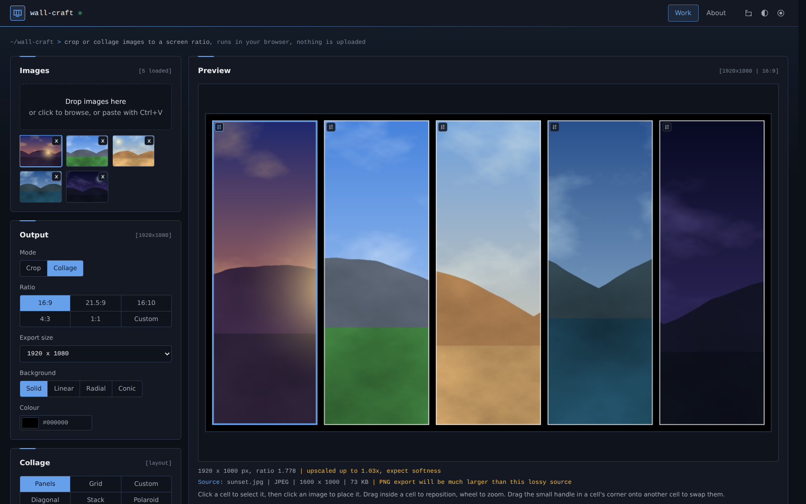
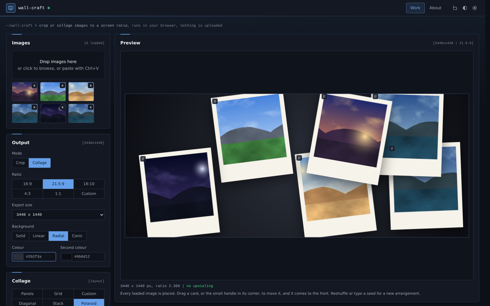
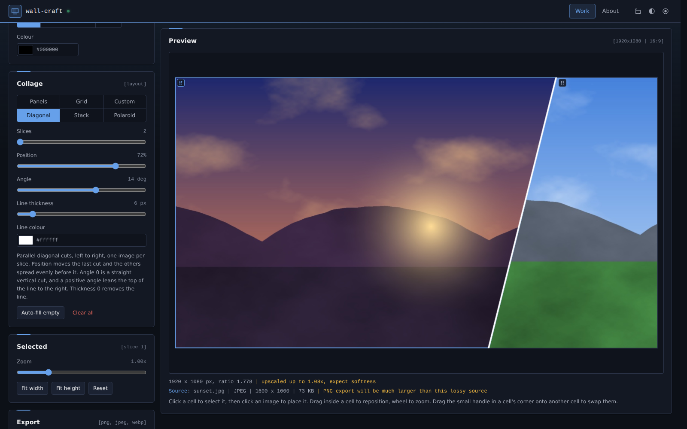
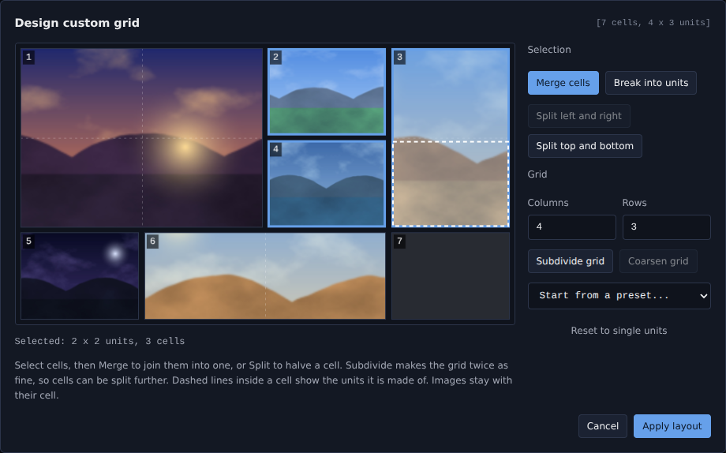
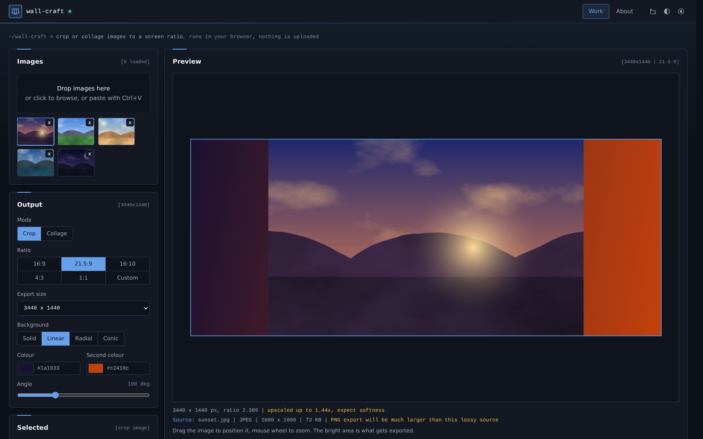
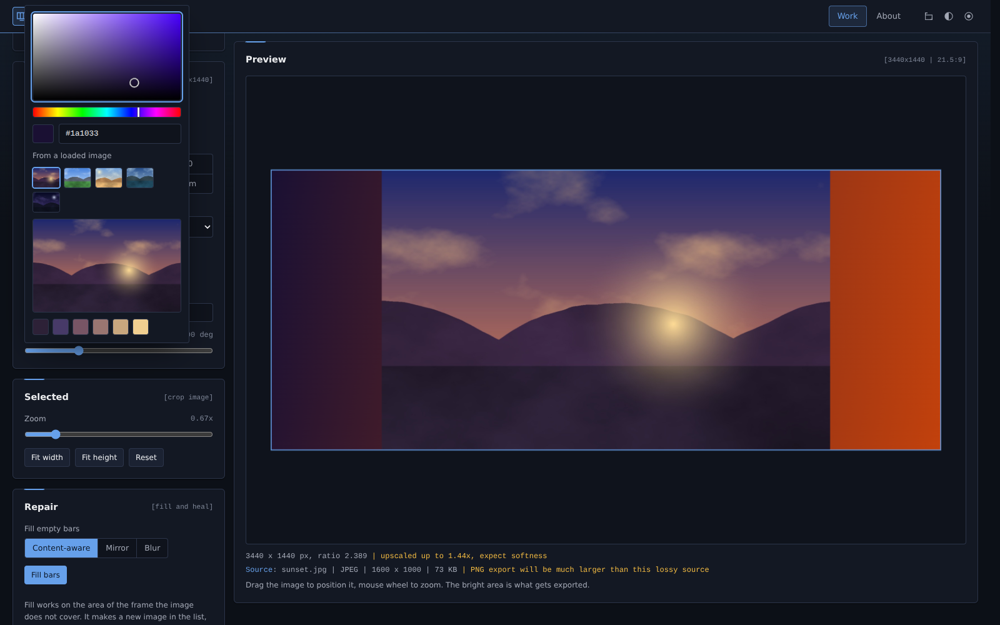
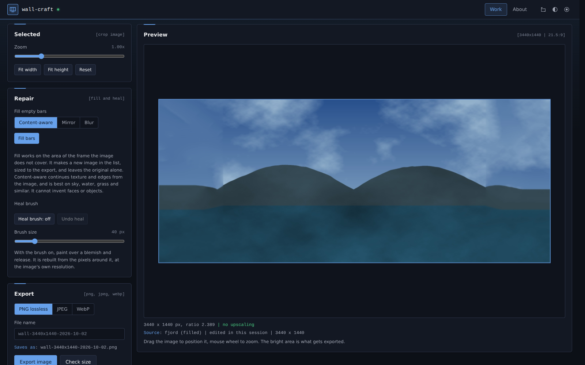
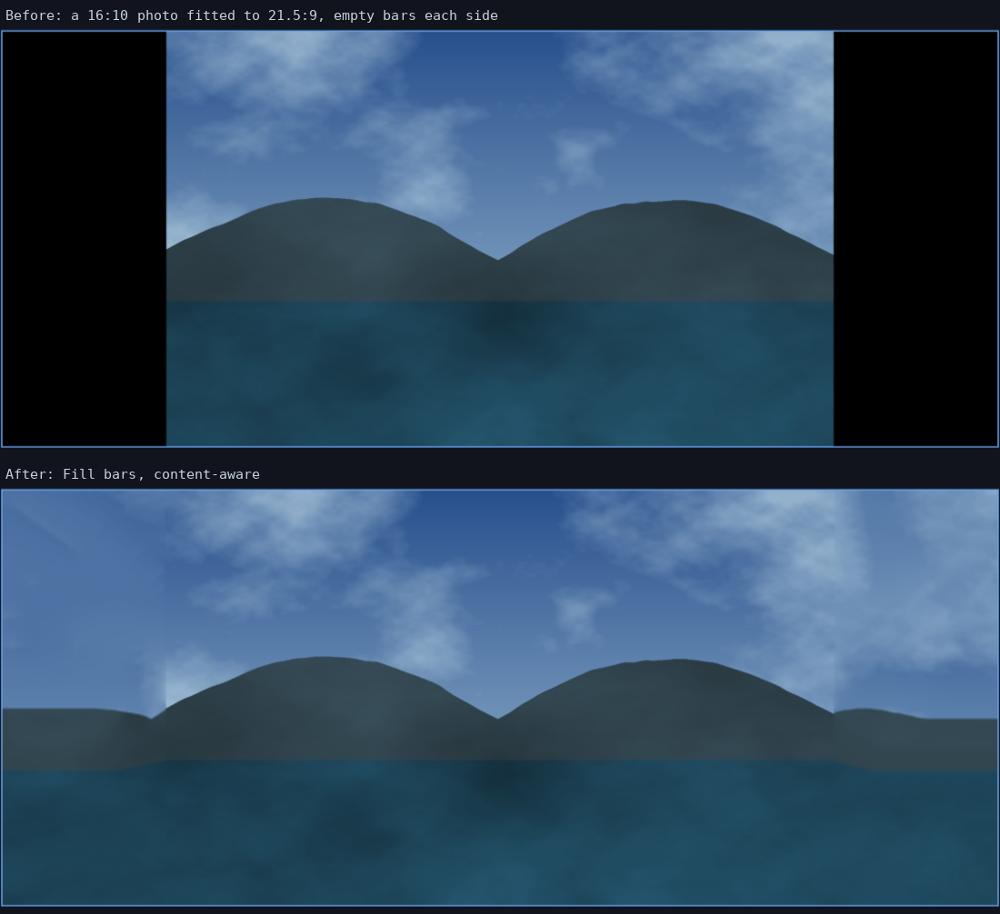

# wall-craft

Turn images into wallpapers at an exact screen size. Crop one image to a ratio, or build a collage from
several, then export at a standard resolution. Includes a content-aware fill for empty bars and a spot
heal brush. One HTML file, no build step, no dependencies, no network calls. Open it from disk or serve it
as a static page. Images are decoded and drawn in your browser and never uploaded.

## What it does

### Collage

- Load several images, pick a layout, and choose which image sits in each cell. Click a cell, then click an
  image in the list, or drag an image from the list onto a cell.
- Reorder by dragging the small handle in the top-left corner of a cell onto another cell. The two swap, and
  the whole cell moves, including its own zoom and position, so each picture keeps its framing. A ghost
  thumbnail follows the pointer and the target cell is outlined. Dropping on an empty cell moves the image
  there. With the keyboard, focus a handle and use the arrow keys to swap with the neighbouring cell.
- Every cell has its own reposition and zoom: drag inside a cell, use the wheel, or the Selected panel.
  Fit width and Fit height set the zoom so that edge of the image matches the cell.
- **Panels**: columns by rows with a gap, an outer margin and a border of your choice. Gap, margin and border
  are tenths of a percent of the width, so a layout looks the same at every export size.
- **Taskbar offset** (Panels and Custom): keeps a strip along the bottom, top, left or right clear, so nothing
  sits under the taskbar. Its size is shown in pixels at the current export size (5% of a 1080 px height is
  54 px). Margin is measured from the edge of that strip. The preview marks the strip with a dashed line,
  and the strip shows the background colour or gradient.
- **Grid**: columns by rows, edge to edge, no gaps or borders, on whole-pixel edges so there are no seams. One
  row gives borderless vertical strips.
- **Custom**: your own layout of merged and split cells, for a hero image or a bento arrangement. See below.
- **Diagonal**: parallel diagonal cuts with one image per slice. See below.
- **Stack** and **Polaroid**: every loaded image is scattered over an even grid with random tilt and a
  shadow, optionally framed as a polaroid. Drag a card, or the small handle in its corner, to move it (it comes
  to the front). With the keyboard, focus a handle and use the arrow keys to nudge it. Each has its own
  border width and colour.
- Stack and polaroid layouts come from a seed. Type one to reproduce an arrangement, or Reshuffle for a new
  one. Changing the seed discards manual card moves.

#### Diagonal slices

A wide image and a portrait one, joined by a slanted cut with a thin line along it.

- **Slices** sets how many images there are (2 to 6), separated by parallel cuts, left to right.
- **Position** puts the last cut at that percentage of the width, measured at mid height. With two slices
  that is the one cut, so 66 to 75 gives the usual two-thirds or three-quarters look. With more slices the
  earlier cuts spread evenly before it.
- **Angle** leans the cut, from -60 to 60 degrees. 0 is a straight vertical cut and a positive angle leans
  the top of the line to the right.
- **Line thickness** is measured across the line, shown in pixels at the current export size, and 0 removes
  the line. **Line colour** uses the colour picker, including sampling from your images.
- Each slice keeps its own zoom and position (drag inside it, wheel to zoom), and the corner handle swaps
  two slices. Slices meet with a sub-pixel overlap, so there is no hairline of background between them even
  with the line off.

#### Custom grid designer

Choose Custom, then Design layout to open a popup. It edits a draft and only changes the page when you
press Apply layout, so Cancel (or Esc) throws it away.

- The canvas is divided into columns by rows of **units**, and every cell is a rectangle of units. Drag
  across the grid to select. The selection grows to take in every cell it touches, so it is always a clean
  rectangle of whole cells.
- **Merge cells** joins the selection into one cell, and the merged cell keeps the first image. **Split
  left and right** and **Split top and bottom** halve a cell. **Break into units** turns a cell back into
  single units.
- **Subdivide grid** makes the grid twice as fine, which is how a cell gets split further. **Coarsen grid**
  undoes that when every cell edge sits on an even unit. Columns and Rows resize the grid (up to 16 by 12),
  and the cell count is capped at 72.
- Start from a preset (Bento, Hero left, Hero top, Pinwheel) or Reset to single units. Images carry over in
  reading order. Dashed lines inside a cell show the units it is made of.
- It works with the keyboard: arrow keys move a cursor and Shift with the arrows selects a block. Focus
  stays inside the popup, and Esc closes it. On a phone it becomes one column and a finger drag selects.
- Gap, outer margin, border and the taskbar offset apply to a custom layout the same way as to Panels. Each cell keeps its own
  zoom and position, and the corner handle swaps two cells.

### Crop

- One image under a fixed-ratio frame. Drag to position, mouse wheel or slider to zoom (0.1x to 8x). The
  bright area is what gets exported, and the dimmed part outside the frame is what gets cut.
- Ratios: 16:9, 21.5:9, 16:10, 4:3, 1:1 and a custom W:H. 21.5:9 is exactly 43:18, the ratio behind 3440x1440 and
  5160x2160.
- The line under the preview shows the active image's name, format, pixel size and file size, so the export
  can be matched to it. It warns when a JPEG or WebP source is set to export as PNG, which is lossless but
  usually many times larger.
- Background behind the image and between panels: solid, or a two-colour linear, radial or conic gradient.
- Colours use a built-in picker rather than the browser's: a saturation and brightness square, a hue strip
  and a hex field, plus a way to take a colour from your own images. Click or drag on a loaded image to
  sample an exact pixel, or take one of its six most common colours. It is used for the background, panel
  borders, and card borders.

### Repair

Crop mode only.

- **Fill bars** fills the part of the frame the image does not cover. It makes a new image in the list at
  the export size, sitting at zoom 1, and leaves the original alone.
  - **Content-aware** continues texture and edges from the image. It is multi-scale PatchMatch with patch
    voting, the family of method behind Photoshop's content-aware fill. It suits sky, water, grass, walls
    and bokeh, for bars up to about a third of the frame per side.
  - **Mirror** reflects the image into the bars. **Blur** puts a softened, scaled copy behind it. Both are
    instant fallbacks for content where content-aware smears.
  - Content-aware runs in slices so the page stays responsive, shows progress, and can be cancelled.
- **Heal brush**: turn it on, paint over a blemish, release. The area is rebuilt from the pixels around it.
  Up to 6 undo steps per image.

What it cannot do: it copies and recombines what is already in the image, so it cannot invent faces or
objects, and detailed structure can repeat or smear. A faint seam at the edge of a fill, as in the example
above, is normal. Generative expand in current Photoshop uses a cloud model, which a single local file
cannot.

### Export

- Standard sizes per ratio. 16:9: 1280x720 up to 7680x4320. 21.5:9: 2580x1080, 3440x1440, 5160x2160,
  5120x2160. 16:10: 1280x800 up to 3840x2400. 4:3: 1024x768 up to 3200x2400. 1:1: 1024x1024 up to 4096x4096. A custom ratio lists widths
  from 1280 to 5120 with the height worked out, or take a custom width. No side goes over 8192.
- The export size sets the real aspect, so 5120x2160 (2.370) gives a slightly narrower frame than
  3440x1440 (2.389).
- PNG (lossless), JPEG or WebP with a quality slider. Check size encodes without downloading so you can see
  the file size first.
- Set the file name before saving. The field shows the default as a placeholder and a live "Saves as" line
  with the final name. The extension always comes from the chosen format, so typing `sunset.webp` does not
  produce `sunset.webp.webp`. Path characters, control characters and names Windows reserves are replaced
  or prefixed, and an empty name falls back to `wall-<width>x<height>-<date>`. Press Enter in the field to
  export. The name is not remembered between visits, so an old name is never reused by accident.
- A warning appears when a source is being enlarged to fill the export size.

## Settings files

> Previously called wall-fit. Settings files and saved browser data from that name still load, and the design, mode
> and accent are carried over automatically on first open.

Save settings writes every control (mode, ratio, layout, colours, seed, card positions) to one JSON file.
Load settings reads it back, validating each field. `Ctrl+S` saves, `Ctrl+O` loads. Settings are also kept
in this browser between visits. Images are held in memory only, so after a reload the settings come back and
the pictures have to be loaded again.

## Getting images in

Drop files on the Images panel or on the preview, click to browse, or copy an image and paste with `Ctrl+V`.
Dragging an image straight out of a web page often hands the browser a link rather than a file, which the
page cannot fetch because the CSP blocks every network request. Copy and paste is the reliable route.

## Where the data goes

Nowhere. Images are decoded with `createImageBitmap` and drawn to a canvas, never inserted into the page.
Settings are kept in this browser's localStorage until you reset. The only way data leaves the page is a
file you download yourself, and the CSP in the head blocks network access. Settings loaded from a file are
clamped and checked, including colours, card positions and image references, before anything reaches the
canvas.

## Limits

- Needs a current browser: Chrome or Edge 90+, Firefox 98+, Safari 15+ (it uses `createImageBitmap`,
  `ResizeObserver` and `replaceChildren`).
- Big photos (over 2400 px) are also kept as a 2048 px copy that the preview draws from whenever the
  screen cannot show more detail, which keeps dragging and zooming smooth. The export always uses the
  full image. Zoom in far enough and the preview switches to the full image on its own.
- Settings files from before Slices was folded into Grid still load: they become a one-row grid with the same
  number of columns.
- Card positions from dragging are tied to the order images were loaded, so they come back with a settings
  file only if you load the same images in the same order. They are dropped on a plain page reload.
- A settings file over 2 MB is refused (they are a few KB).
- Fill bars treats transparent pixels in an image as empty, so a PNG with transparent corners gets them
  filled too.
- Reset, Load settings and removing an image are refused while a fill or heal is running, rather than
  racing it.
- 40 images per session.
- Export width is capped at 8192. Very large exports need a lot of memory and a browser that allows a canvas
  that size.
- Fill and heal edit a canvas copy of the image in memory. An image over 120 megapixels is refused.
- Content-aware fill is solved at up to 768 px on the long side and scaled up behind the sharp image, so
  the filled area is softer than the original.
- JPEG and WebP encoding depend on the browser. If a format is not supported, the browser writes PNG and
  the page says so.
- Conic gradients need `createConicGradient`. Without it the background falls back to solid.

## Appearance

Three independent controls in the top bar, each saved separately, so changing one never resets the others.

**Design** sets the shape language, surface hue and backdrop texture:

| Design | Shape | Backdrop |
|---|---|---|
| `cobalt` | Slight radius, navy | Blue glow from the top, accent rules on each panel. The default |
| `chamfer` | Cut corners | Instrument grid |
| `console` | Square, graphite | Horizontal scan rules |
| `contour` | Soft radii | A single accent wash |

**Mode** sets the lightness ramp only, and every design supports every mode:

| Mode | Base |
|---|---|
| `dark` | Lights off. The default |
| `dusk` | Dark, lifted off black, for long sessions |
| `sepia` | Warm paper, bright but low glare |
| `light` | Cool white, closest to print |

**Accent** is any hue. Eight presets are offered, plus a hue/chroma wheel and a hex field. The accent's
lightness is measured against the surface it sits on, so any hue stays readable in any combination. The
favicon is the wall-craft logo painted in the live accent.

Printing forces one light palette regardless of design and mode and keeps the bar as a masthead.

## Built from

The single-file-tool template: the same shell, appearance system, state
layer, CSP and CI check as the other tools in the set. The workspace fills the screen instead of the
template's capped column (`--wrap: none`).

Screenshots use generated sample images.

## Deployment

`_headers` (Netlify, Cloudflare Pages) and `.htaccess` (Apache) carry the same CSP and hardening headers.
Neither is needed to run the file locally, including from `file://`. The policy is the template's
unchanged: `default-src 'none'`, no network, no eval, no remote fonts or scripts.

## Licence

MIT. See `LICENSE`.
